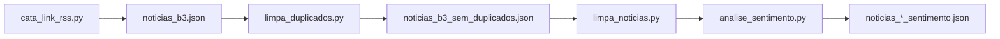
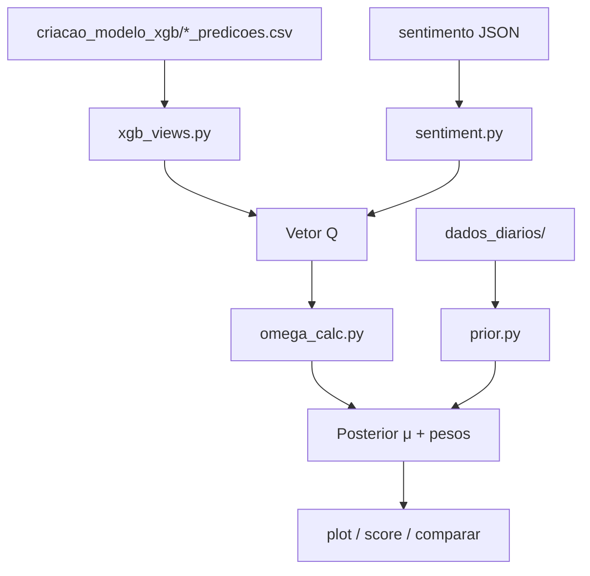

# Toledo Portfolio Optimization

Pipeline de pesquisa para **otimização de portfólio na B3** combinando views quantitativas (XGBoost), análise de sentimento e o modelo **Black-Litterman**.

```
tickers_data + dados_diarios + notícias
        ↓
criacao_modelo_xgb/*_predicoes.csv  (views quantitativas)
        ↓
Views Q (XGB + sentimento) → Omega → Prior π → Posterior μ → Pesos
        ↓
Avaliação (backtest, score, Markowitz)
```

> **Decisão arquitetural:** o único modelo quantitativo para o vetor Q é o **XGBoost**. As predições entram via `criacao_modelo_xgb/*_predicoes.csv`.

---

## Índice

1. [Estrutura do projeto](#estrutura-do-projeto)
2. [Pré-requisitos de dados](#pré-requisitos-de-dados)
3. [Como executar](#como-executar)
4. [Pipeline de notícias](#pipeline-de-notícias)
5. [Pipeline Black-Litterman](#pipeline-black-litterman)
6. [Saídas geradas](#saídas-geradas)
7. [Módulos e parâmetros](#módulos-e-parâmetros)
8. [Dependências](#dependências)

---

## Estrutura do projeto

```
toledo-portfolio-optimizationn/
├── .env                           # OPENAI_API_KEY (não versionar)
├── .gitignore
├── requirements.txt
├── README.md
│
├── dados_diarios/                 # OHLCV diário por ticker (close, volume, features)
│   ├── VALE3.csv, BBAS3.csv, ...
│   ├── IBOV.csv                   # Ibovespa (benchmark)
│   └── USDBRL.csv                 # Macro
│
├── tickers_data/                  # CSVs horários B3 (BMFBOVESPA_DLY_*, 60 min)
│   └── BMFBOVESPA_DLY_VALE3, 60.csv, ...
│
├── criacao_modelo_xgb/            # Artefatos do regressor XGB (vetor Q)
│   ├── TICKER_predicoes.csv       # ★ Entrada principal do BL (walk-forward OOF)
│   ├── TICKER_model.pkl           # Modelo treinado por ticker
│   ├── TICKER_scaler_y.pkl        # Scaler do target
│   ├── q_vetor.csv                # Snapshot Q por ticker
│   ├── omega_base.csv             # Ω base por ticker
│   └── metricas_*.csv             # Métricas OOF
│
└── intel/
    ├── __init__.py
    │
    ├── Blacklitterman/            # Pipeline BL (pacote Python)
    │   ├── __init__.py
    │   ├── config.py              # Parâmetros e caminhos centralizados
    │   ├── pipeline.py            # ★ Pipeline principal
    │   ├── xgb_views.py           # Views Q via XGBoost + sentimento
    │   ├── sentiment.py           # Agregação de sentimento diário
    │   ├── omega_calc.py          # Matriz Ω dinâmica
    │   ├── prior.py               # Prior π, posterior BL, controles de peso
    │   ├── weights.py             # Projeção long-only com teto por ativo
    │   ├── io_utils.py            # Leitura/escrita CSV com datas
    │   ├── plot_ganho_estimado.py # Backtest de capital estimado vs realizado
    │   ├── score_modelo.py        # Score composto 0–100
    │   ├── comparar_bl_vs_markowitz.py
    │   ├── Q.py                   # Q standalone (ticker ABEV3)
    │   ├── omega.py               # Ω standalone
    │   ├── PI.py                  # Prior π standalone (retornos diários)
    │   ├── PI_incerteza.py        # Prior π com retornos VWAP intradiários
    │   ├── README.md
    │   └── outputs/               # ★ Todas as saídas de execução (CSV/PNG)
    │       ├── pipeline/          # pipeline.py
    │       ├── backtest/          # plot_ganho_estimado.py
    │       ├── score/             # score_modelo.py
    │       ├── markowitz/         # comparar_bl_vs_markowitz.py
    │       ├── figures/           # gráficos PNG
    │       └── standalone/        # Q.py, omega.py, PI_incerteza.py
    │
    └── data_acquisition/          # Coleta e processamento de notícias
        ├── __init__.py
        ├── config.py              # Paths JSON, tickers RSS, parâmetros OpenAI
        ├── cata_link_rss.py       # Coleta via Google News RSS
        ├── limpa_duplicados.py    # Remove duplicatas por título
        ├── limpa_noticias.py      # Remove títulos genéricos (sem menção ao ticker)
        ├── analise_sentimento.py  # Classificação GPT (positivo/negativo/neutro)
        ├── extrair_search_xml.py  # Extrai itens de search.xml → JSON/CSV
        ├── ordenar_noticias_por_data.py
        ├── traduz_link_do_rss.py  # Resolve link_google → link real (Playwright)
        ├── search.xml             # Feed RSS/Atom de referência
        ├── noticias_b3.json
        ├── noticias_b3_sem_duplicados.json
        ├── noticias_b3_sem_duplicados_com_link_real.json
        └── noticias_b3_sem_duplicados_sentimento.json  # ★ Entrada do BL
```

---

## Pré-requisitos de dados

O pipeline Black-Litterman **não treina** o XGBoost — consome artefatos já gerados.

### 1. Predições XGBoost (`criacao_modelo_xgb/`)

| Arquivo | Colunas esperadas | Uso |
|---------|-------------------|-----|
| `TICKER_predicoes.csv` | `date`, `y_pred`, `y_real` | Views quantitativas (walk-forward OOF) |
| `noticias_b3_sem_duplicados_sentimento.json` | `ticker`, `titulo`, `sentimento`, `data` | Overlay qualitativo |

O módulo `xgb_views.py` localiza automaticamente `TICKER_predicoes.csv` (ou variantes `*_h21d_predicoes.csv`).

> **Nota:** os scripts de treino (`criacao_modelo_xgb.py`, `novo_input_dados.py`, `prepara_dados.py`) **não estão neste repositório**. O diretório `criacao_modelo_xgb/` contém os artefatos já produzidos. Para atualizar as predições, é necessário rodar o pipeline de treino XGB externamente ou restaurar esses scripts.

### 2. Preços diários (`dados_diarios/`)

CSV por ticker com pelo menos `date` e `close`. Usados pelo `prior.py` para calcular Σ e π.

Ativos do pipeline BL (`config.py`): **VALE3, BBAS3, ITUB4, BBDC4, ABEV3**.

### 3. Preços horários (`tickers_data/`)

CSVs `BMFBOVESPA_DLY_TICKER, 60.csv`. Usados apenas por `PI_incerteza.py` (retornos VWAP 7h).

### 4. Notícias com sentimento

Arquivo consumido pelo BL: `intel/data_acquisition/noticias_b3_sem_duplicados_sentimento.json`.

---

## Como executar

### 1. Ambiente

```bash
python -m venv venv
venv\Scripts\activate          # Windows
# source venv/bin/activate     # Linux/macOS
pip install -r requirements.txt
```

Crie `.env` na raiz com:

```
OPENAI_API_KEY=sk-...
```

Necessário apenas para `analise_sentimento.py`.

### 2. Atualizar notícias (opcional)

```bash
cd intel/data_acquisition
python cata_link_rss.py
python limpa_duplicados.py
python limpa_noticias.py
python analise_sentimento.py
```

### 3. Pipeline Black-Litterman

```bash
cd intel/Blacklitterman
python pipeline.py
python plot_ganho_estimado.py
python score_modelo.py
python comparar_bl_vs_markowitz.py
```

`plot_ganho_estimado.py`, `score_modelo.py` e `comparar_bl_vs_markowitz.py` dependem das saídas de `pipeline.py`.

---

## Pipeline de notícias



| Script | Entrada | Saída | Descrição |
|--------|---------|-------|-----------|
| `cata_link_rss.py` | Google News RSS | `noticias_b3.json` | Coleta semanal por ticker (2025) |
| `limpa_duplicados.py` | `noticias_b3.json` | `noticias_b3_sem_duplicados.json` | Remove títulos duplicados |
| `limpa_noticias.py` | JSON deduplicado | (sobrescreve) | Remove títulos sem menção ao ticker/empresa |
| `analise_sentimento.py` | JSON limpo | `noticias_*_sentimento.json` | Classificação GPT |
| `extrair_search_xml.py` | `search.xml` | `files/search_extract.json` | Extração alternativa de feed local |
| `traduz_link_do_rss.py` | JSON | JSON com `link_real` | Resolve redirects do Google News (Playwright) |
| `ordenar_noticias_por_data.py` | `search_extract.json` | JSON ordenado | Ordenação por data de publicação |

Tickers na coleta RSS (`data_acquisition/config.py`): VALE3, BBAS3, ITUB3, BBDC3, ABEV3.

---

## Pipeline Black-Litterman



### Scripts

| Script | Função |
|--------|--------|
| `pipeline.py` | **Pipeline completo:** Q → Ω → PI → posterior → pesos controlados |
| `plot_ganho_estimado.py` | Curvas de capital estimado vs realizado vs Selic |
| `score_modelo.py` | Score 0–100 (previsão + portfólio + risco) |
| `comparar_bl_vs_markowitz.py` | BL vs Markowitz puro (rolling) |

### Scripts standalone

| Script | Função |
|--------|--------|
| `Q.py` | Gera views Q para um ticker (padrão: ABEV3) → `outputs/` |
| `omega.py` | Calcula Ω a partir do Q standalone |
| `PI.py` | Imprime prior π com retornos diários (`dados_diarios/`) |
| `PI_incerteza.py` | Prior π com retornos VWAP 7h (`tickers_data/`) — metodologia distinta |

### Fórmula da view Q

```
Q = α · ret_pred + (1 − α) · sentiment_component
```

- `ret_pred` — log-retorno previsto pelo XGB (`y_pred`)
- `sentiment_component` — sinal de sentimento escalado por `ret_scale`
- `α` = `ALPHA_Q` = 0.50

### Posterior Black-Litterman

```
μ_posterior = [(τΣ)⁻¹ + P'Ω⁻¹P]⁻¹ [(τΣ)⁻¹π + P'Ω⁻¹Q]
```

Pesos com controles: long-only, teto de 35% por ativo, rebalanceamento daily/weekly/monthly.

---

## Saídas geradas

Todas as saídas ficam em `intel/Blacklitterman/outputs/`. Ver também [`outputs/README.md`](intel/Blacklitterman/outputs/README.md).

```
outputs/
├── pipeline/       # pipeline.py
├── backtest/       # plot_ganho_estimado.py
├── score/          # score_modelo.py
├── markowitz/      # comparar_bl_vs_markowitz.py
├── figures/        # gráficos PNG
└── standalone/     # Q.py, omega.py, PI_incerteza.py
```

### `pipeline.py` → `outputs/pipeline/`

| Arquivo | Conteúdo |
|---------|----------|
| `bl_hibrido_q_long.csv` | Views Q diárias por ticker |
| `bl_hibrido_omega_long.csv` | Ω dinâmico por dia/ticker |
| `bl_hibrido_posterior_mu.csv` | Retorno posterior μ |
| `bl_hibrido_posterior_weights_controlled_daily.csv` | Pesos com restrições (daily) |
| `bl_hibrido_posterior_weights_controlled_weekly.csv` | Pesos (weekly) |
| `bl_hibrido_posterior_weights_controlled_monthly.csv` | Pesos (monthly) |
| `bl_hibrido_pi.csv` | Prior π por ticker |
| `bl_hibrido_sigma.csv` | Matriz de covariância Σ |

### `plot_ganho_estimado.py` → `outputs/backtest/` + `outputs/figures/`

| Arquivo | Pasta | Conteúdo |
|---------|-------|----------|
| `bl_hibrido_ganho_series_*.csv` | backtest | Série de capital por modo |
| `bl_hibrido_ganho_comparativo.csv` | backtest | Comparativo entre modos |
| `bl_hibrido_ganho_estimado.png` | figures | Gráfico |

### `score_modelo.py` → `outputs/score/`

| Arquivo | Conteúdo |
|---------|----------|
| `bl_hibrido_score_summary.csv` | Score total 0–100 |
| `bl_hibrido_score_mensal.csv` | Score por mês |
| `bl_hibrido_rebalance_resumo.csv` | Comparação daily/weekly/monthly |
| `bl_hibrido_score_previsao_*.csv` | Métricas de previsão |

### `comparar_bl_vs_markowitz.py` → `outputs/markowitz/` + `outputs/figures/`

| Arquivo | Pasta | Conteúdo |
|---------|-------|----------|
| `bl_vs_markowitz_comparativo.csv` | markowitz | BL vs Markowitz vs Selic |
| `bl_vs_markowitz_resumo.csv` | markowitz | Sharpe, drawdown, capital final |
| `markowitz_weights_*.csv` | markowitz | Pesos Markowitz por modo |
| `bl_vs_markowitz_plot.png` | figures | Gráfico comparativo |

---

## Módulos e parâmetros

| Módulo | Responsabilidade |
|--------|------------------|
| `config.py` | Paths, tickers, parâmetros globais |
| `xgb_views.py` | Carrega predições XGB, combina com sentimento → Q |
| `sentiment.py` | Agrega sentimento diário por ticker (JSON GPT) |
| `omega_calc.py` | Incerteza dinâmica Ω por view |
| `prior.py` | Prior π, posterior BL, controles e rebalanceamento |
| `weights.py` | Projeção long-only com teto por ativo |
| `io_utils.py` | Utilitários de leitura/escrita CSV |

### Parâmetros principais (`intel/Blacklitterman/config.py`)

| Parâmetro | Valor | Descrição |
|-----------|-------|-----------|
| `ATIVOS` | VALE3, BBAS3, ITUB4, BBDC4, ABEV3 | Universo do portfólio |
| `PERIOD_START` / `PERIOD_END` | 202501 / 202512 | Janela das views Q |
| `ALPHA_Q` | 0.50 | Peso modelo vs sentimento |
| `TAU` | 0.025 | Escala de incerteza do prior |
| `RISK_FREE_ANNUAL` | 0.15 | Taxa livre de risco (Selic proxy) |
| `LONG_ONLY` | `True` | Sem posições vendidas |
| `MAX_WEIGHT_PER_ASSET` | 0.35 | Teto por ativo |
| `USE_ROLLING_PRIOR` | `True` | Prior π rolling (60 obs mín.) |
| `INITIAL_CAPITAL_BRL` | 100.000 | Capital base no backtest |

---

## Dependências

Ver [`requirements.txt`](requirements.txt).

| Categoria | Pacotes |
|-----------|---------|
| Core | `pandas`, `numpy`, `scikit-learn`, `matplotlib` |
| Dados | `yfinance` |
| ML (artefatos XGB) | `xgboost`, `joblib`, `optuna` |
| Sentimento | `openai`, `python-dotenv` |
| Notícias | `feedparser` |
| Opcional | `shap`, `lightgbm`, `playwright` |

---

## Referências

- [`intel/Blacklitterman/README.md`](intel/Blacklitterman/README.md) — detalhes do módulo BL e convenções de código
