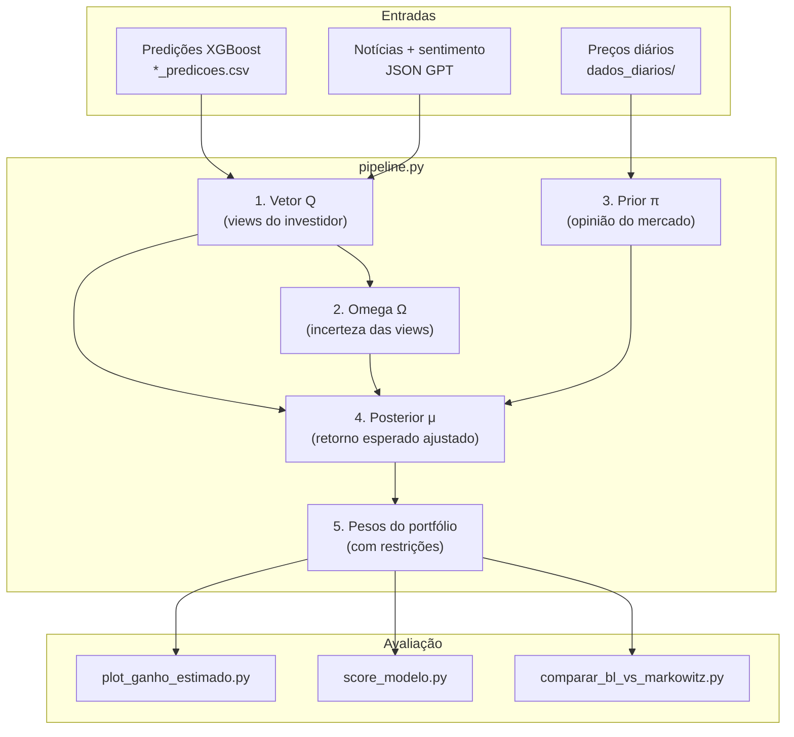

# Como o código funciona

Documentação de leitura do pipeline de otimização de portfólio B3: **predições XGBoost** + **sentimento de notícias** → **Black-Litterman** → pesos de portfólio e avaliação.

---

## Índice

1. [O problema que resolve](#o-problema-que-resolve)
2. [Visão geral do fluxo](#visão-geral-do-fluxo)
3. [Dados de entrada](#dados-de-entrada)
4. [Pipeline principal (`pipeline.py`)](#pipeline-principal-pipelinepy)
5. [Pipeline de notícias (opcional)](#pipeline-de-notícias-opcional)
6. [Scripts de avaliação](#scripts-de-avaliação)
7. [Estrutura do código](#estrutura-do-código)
8. [Configuração](#configuração)
9. [Ordem de execução](#ordem-de-execução)
10. [Saídas geradas](#saídas-geradas)
11. [Resumo em uma frase](#resumo-em-uma-frase)

---

## O problema que resolve

O projeto responde à pergunta: **como dividir capital entre 5 ações da B3** (VALE3, BBAS3, ITUB4, BBDC4, ABEV3) combinando previsões de machine learning, sentimento de notícias e teoria de portfólio.

Não é uma aplicação web — é um conjunto de scripts Python que leem dados, calculam resultados e salvam CSVs e gráficos em `intel/Blacklitterman/outputs/`.

### Por que Black-Litterman?

Você tem opiniões sobre o futuro de cada ação (chamadas de **views**), mas não quer ignorar o mercado nem assumir 100% de certeza nas previsões. O modelo **Black-Litterman** faz exatamente isso: mistura a **opinião do investidor** com o **equilíbrio de mercado**, ponderando pela **confiança** em cada view.

Suas views vêm de duas fontes:

| Fonte | Origem | O que representa |
|-------|--------|------------------|
| **Quantitativa** | XGBoost (`criacao_modelo_xgb/*_predicoes.csv`) | Log-retorno esperado por ativo/dia |
| **Qualitativa** | GPT sobre manchetes (`noticias_*_sentimento.json`) | Viés positivo/negativo/neutro |

---

## Visão geral do fluxo



---

## Dados de entrada

| Dado | Caminho | Para quê |
|------|---------|----------|
| Predições XGB | `criacao_modelo_xgb/TICKER_predicoes.csv` | Retorno esperado por ativo/dia (`y_pred`, `y_real`) |
| Notícias classificadas | `intel/data_acquisition/noticias_b3_sem_duplicados_sentimento.json` | Viés qualitativo diário por ticker |
| Preços diários | `dados_diarios/TICKER.csv` | Covariância, prior de mercado, backtest |
| Preços horários (opcional) | `tickers_data/` | Usado apenas em `PI_incerteza.py` (prior com VWAP) |

> **Importante:** as predições XGB já estão no repositório (geradas externamente). O pipeline **não treina** o XGBoost — apenas consome os CSVs de predição.

---

## Pipeline principal (`pipeline.py`)

O arquivo `pipeline.py` orquestra cinco etapas em sequência. Cada etapa depende da anterior.

### Etapa 1 — Vetor Q (sua opinião sobre retornos)

**Módulos:** `xgb_views.py` + `sentiment.py`

Para cada ativo e cada dia no período configurado (padrão: jan–dez/2025):

1. Lê a previsão XGB (`y_pred` = log-retorno esperado)
2. Agrega notícias do dia em um sinal de sentimento (−1 a +1)
3. Combina os dois com peso `ALPHA_Q`:

```
Q = ALPHA_Q × previsão_XGB + (1 − ALPHA_Q) × (sentimento × escala_de_retorno)
```

Com `ALPHA_Q = 0.50` (padrão), cada fonte contribui com 50%.

A **escala de retorno** evita que o sentimento (−1, 0, +1) fique em unidade errada — ela é baseada na volatilidade recente do ativo (janela de 14 dias).

**Saída:** `outputs/pipeline/bl_hibrido_q_long.csv`

---

### Etapa 2 — Omega Ω (quanto você confia em cada view)

**Módulo:** `omega_calc.py`

Para cada dia e ativo, calcula a **incerteza** da view:

| Fator | Efeito |
|-------|--------|
| **Erro histórico** da previsão XGB | Se o modelo erra muito, Ω sobe → menos confiança |
| **Quantidade de notícias** | Mais notícias = um pouco mais de confiança |
| **Variância do ativo** | Base estatística da incerteza |

Views com Ω **alto** pesam **menos** na fórmula final. Views com Ω **baixo** pesam **mais**.

**Saídas:**
- `outputs/pipeline/bl_hibrido_omega_long.csv`
- `outputs/pipeline/bl_hibrido_q_omega_long.csv` (Q + Ω unidos)

---

### Etapa 3 — Prior π (o que o mercado “acha”)

**Módulo:** `prior.py`

Sem suas views, o mercado tem uma opinião implícita de equilíbrio:

1. Busca **market cap** de cada ação via `yfinance`
2. Calcula **retornos logarítmicos diários** a partir de `dados_diarios/`
3. Estima a **matriz de covariância Σ** entre os ativos
4. Deriva **π = δ × Σ × w_mercado** — retorno de equilíbrio que justificaria os pesos de mercado atuais

Com `USE_ROLLING_PRIOR = True` (padrão), esse prior é **recalculado dia a dia** com janela móvel (mínimo de 60 observações), em vez de ficar fixo no início do período.

**Saídas:**
- `outputs/pipeline/bl_hibrido_pi.csv`
- `outputs/pipeline/bl_hibrido_sigma.csv`
- `outputs/pipeline/bl_hibrido_prior_cov_tau_sigma.csv`

---

### Etapa 4 — Posterior μ (retorno esperado final)

**Módulo:** `prior.py` → `compute_daily_bl_posterior`

Para **cada dia**, aplica a fórmula Black-Litterman:

```
μ_posterior = combina(π, Q, Ω, Σ, τ)
```

Em palavras: o retorno esperado de cada ativo é um **compromisso** entre o mercado (π) e suas views (Q), onde views mais confiáveis (Ω menor) puxam mais o resultado.

Depois converte μ em pesos brutos do portfólio:

```
w ∝ Σ⁻¹ × μ
```

**Saídas:**
- `outputs/pipeline/bl_hibrido_posterior_mu.csv`
- `outputs/pipeline/bl_hibrido_posterior_weights.csv`

---

### Etapa 5 — Controles e rebalanceamento

**Módulos:** `prior.py` + `weights.py`

Os pesos brutos passam por restrições reais de investimento:

| Regra | Valor padrão | Descrição |
|-------|--------------|-----------|
| `LONG_ONLY` | `True` | Sem venda a descoberto |
| `MAX_WEIGHT_PER_ASSET` | `0.35` | Máximo 35% em uma única ação |

Gera três versões de rebalanceamento a partir dos pesos controlados:

| Modo | Comportamento |
|------|---------------|
| **daily** | Ajusta pesos todo dia útil |
| **weekly** | Rebalanceia toda semana |
| **monthly** | Rebalanceia todo mês |

**Saídas:**
- `outputs/pipeline/bl_hibrido_posterior_weights_controlled.csv`
- `outputs/pipeline/bl_hibrido_posterior_weights_controlled_daily.csv`
- `outputs/pipeline/bl_hibrido_posterior_weights_controlled_weekly.csv`
- `outputs/pipeline/bl_hibrido_posterior_weights_controlled_monthly.csv`

---

## Pipeline de notícias (opcional)

Em `intel/data_acquisition/`, um fluxo separado alimenta o sentimento usado pelo Black-Litterman:

```
Google News RSS → remove duplicatas → filtra títulos irrelevantes → GPT classifica → JSON
```

| Script | Função |
|--------|--------|
| `cata_link_rss.py` | Coleta manchetes por ticker/semana |
| `limpa_duplicados.py` | Remove títulos repetidos |
| `limpa_noticias.py` | Remove notícias sem menção ao ticker |
| `analise_sentimento.py` | GPT classifica: positivo / negativo / neutro |

O BL consome o JSON final via `sentiment.py`, que agrega por dia e ticker.

> **Nota:** em `data_acquisition/config.py` os tickers de notícias podem usar ITUB3/BBDC3, enquanto o BL usa ITUB4/BBDC4. O agrupamento por empresa em `sentiment.py` mitiga essa diferença.

---

## Scripts de avaliação

Rodados **depois** do `pipeline.py`, usando os CSVs gerados.

### `plot_ganho_estimado.py`

Simula um capital inicial de **R$ 100.000** seguindo os pesos do portfólio BL e compara:

- Retorno **estimado** (baseado nas views)
- Retorno **realizado** (preços reais)
- Benchmark **Selic** (15% a.a.)

Gera séries diária/semanal/mensal e gráfico em `outputs/figures/`.

### `score_modelo.py`

Calcula uma **nota composta de 0 a 100** combinando:

- Qualidade das previsões (erro XGB vs realizado)
- Performance do portfólio
- Métricas de risco

### `comparar_bl_vs_markowitz.py`

Compara a estratégia Black-Litterman com:

- **Markowitz puro** (média + covariância rolling, sem views)
- **Selic** como benchmark

Gera CSVs comparativos e gráfico `bl_vs_markowitz_plot.png`.

---

## Estrutura do código

```
intel/Blacklitterman/
├── config.py                  # Parâmetros e caminhos centralizados
├── pipeline.py                # ★ Pipeline completo (Q + Ω + PI + posterior)
├── xgb_views.py               # Views Q a partir do XGBoost
├── sentiment.py               # Agregação de sentimento (notícias GPT)
├── omega_calc.py              # Matriz de incerteza Ω
├── prior.py                   # Prior π, posterior BL e controles de peso
├── weights.py                 # Projeção long-only com teto por ativo
├── io_utils.py                # Utilitários de I/O CSV
├── Q.py                       # Q standalone (um ticker)
├── omega.py                   # Ω standalone
├── PI.py                      # Prior π standalone (retornos diários)
├── PI_incerteza.py            # Prior π com retornos VWAP intradiários
├── plot_ganho_estimado.py     # Backtest de capital estimado vs realizado
├── score_modelo.py            # Score composto 0–100
├── comparar_bl_vs_markowitz.py
└── outputs/                   # Todas as saídas (CSV/PNG)
    ├── pipeline/              # Saídas do pipeline.py
    ├── backtest/              # Saídas do plot_ganho_estimado.py
    ├── score/                 # Saídas do score_modelo.py
    ├── markowitz/             # Saídas do comparar_bl_vs_markowitz.py
    ├── figures/               # Gráficos PNG
    └── standalone/            # Saídas dos scripts Q, omega, PI
        ├── q/
        ├── omega/
        └── prior/
```

---

## Configuração

Todos os parâmetros principais estão em `intel/Blacklitterman/config.py`.

### Ativos e período

| Parâmetro | Valor padrão | Descrição |
|-----------|--------------|-----------|
| `ATIVOS` | VALE3, BBAS3, ITUB4, BBDC4, ABEV3 | Universo do portfólio |
| `PERIOD_START` | `"202501"` | Início das views (ano+mês) |
| `PERIOD_END` | `"202512"` | Fim das views |
| `PRIOR_START_DATE` | `"2023-01-01"` | Início do histórico para Σ |
| `PRIOR_END_DATE` | `"2025-12-31"` | Fim do histórico para Σ |

### Views (Q)

| Parâmetro | Valor padrão | Descrição |
|-----------|--------------|-----------|
| `ALPHA_Q` | `0.50` | Peso do XGB vs sentimento (50/50) |
| `RET_SCALE_WINDOW` | `14` | Janela para escalar sentimento |
| `RET_SCALE_FALLBACK` | `0.005` | Escala padrão se histórico insuficiente |

### Black-Litterman

| Parâmetro | Valor padrão | Descrição |
|-----------|--------------|-----------|
| `TAU` | `0.025` | Escala da incerteza do prior |
| `RISK_FREE_ANNUAL` | `0.15` | Taxa livre de risco (Selic) |
| `USE_ROLLING_PRIOR` | `True` | Prior recalculado dia a dia |
| `ROLLING_MIN_OBS` | `60` | Mínimo de dias para prior rolling |

### Portfólio

| Parâmetro | Valor padrão | Descrição |
|-----------|--------------|-----------|
| `LONG_ONLY` | `True` | Apenas posições compradas |
| `MAX_WEIGHT_PER_ASSET` | `0.35` | Teto de 35% por ativo |
| `INITIAL_CAPITAL_BRL` | `100_000` | Capital inicial no backtest |

### Caminhos de dados

| Parâmetro | Caminho |
|-----------|---------|
| `DATA_DAILY_DIR` | `dados_diarios/` |
| `XGB_DIR` | `criacao_modelo_xgb/` |
| `NEWS_PATH` | `intel/data_acquisition/noticias_b3_sem_duplicados_sentimento.json` |

---

## Ordem de execução

### Pré-requisitos

1. Ambiente Python com dependências (`pip install -r requirements.txt`)
2. Arquivos de predição XGB em `criacao_modelo_xgb/`
3. Preços diários em `dados_diarios/`
4. JSON de sentimento (opcional, mas recomendado)

### Comandos

```bash
cd intel/Blacklitterman

# 1. Pipeline principal (obrigatório)
python pipeline.py

# 2. Avaliação (opcional, na ordem abaixo)
python plot_ganho_estimado.py
python score_modelo.py
python comparar_bl_vs_markowitz.py
```

### Scripts standalone (debug / um componente isolado)

```bash
python Q.py              # Só o vetor Q
python omega.py          # Só a matriz Ω
python PI.py             # Só o prior π (retornos diários)
python PI_incerteza.py   # Prior π com VWAP intradiário
```

---

## Saídas geradas

### Pipeline (`outputs/pipeline/`)

| Arquivo | Conteúdo |
|---------|----------|
| `bl_hibrido_q_long.csv` | Views Q por dia/ticker |
| `bl_hibrido_omega_long.csv` | Incerteza Ω por dia/ticker |
| `bl_hibrido_q_omega_long.csv` | Q + Ω combinados |
| `bl_hibrido_pi.csv` | Prior de equilíbrio π |
| `bl_hibrido_sigma.csv` | Matriz de covariância Σ |
| `bl_hibrido_posterior_mu.csv` | Retorno esperado posterior |
| `bl_hibrido_posterior_weights*.csv` | Pesos do portfólio (brutos, controlados, rebalanceados) |

### Backtest (`outputs/backtest/` + `outputs/figures/`)

| Arquivo | Conteúdo |
|---------|----------|
| `bl_hibrido_ganho_series_*.csv` | Séries de capital ao longo do tempo |
| `bl_hibrido_ganho_comparativo.csv` | Comparativo estimado vs realizado |
| `figures/bl_hibrido_ganho_estimado.png` | Gráfico do backtest |

### Score (`outputs/score/`)

| Arquivo | Conteúdo |
|---------|----------|
| `bl_hibrido_score_summary.csv` | Nota final 0–100 |
| `bl_hibrido_score_mensal.csv` | Score por mês |
| `bl_hibrido_score_previsao_*.csv` | Métricas de qualidade das previsões |

### Markowitz (`outputs/markowitz/` + `outputs/figures/`)

| Arquivo | Conteúdo |
|---------|----------|
| `bl_vs_markowitz_comparativo.csv` | Retornos BL vs Markowitz vs Selic |
| `bl_vs_markowitz_resumo.csv` | Resumo estatístico |
| `figures/bl_vs_markowitz_plot.png` | Gráfico comparativo |

---

## Resumo em uma frase

O código **lê previsões de retorno (XGB) e sentimento de notícias (GPT)**, transforma isso em **views do investidor com nível de confiança**, **combina com a opinião implícita do mercado** via Black-Litterman, e **entrega pesos de alocação** com controles de risco — depois **avalia** se essa estratégia teria sido boa comparada a benchmarks.

---

## Referências rápidas

- Configuração detalhada: [`config.py`](config.py)
- README técnico do módulo: [`README.md`](README.md)
- Mapa das saídas: [`outputs/README.md`](outputs/README.md)
- README do repositório: [`../../README.md`](../../README.md)
