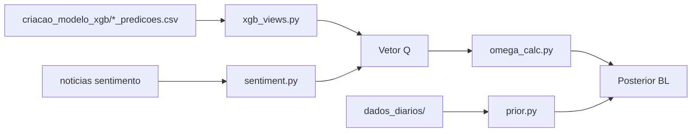

# Black-Litterman (`intel/Blacklitterman`)

Pipeline de otimização de portfólio com views via **XGBoost** + sentimento.

## Estrutura

```
intel/Blacklitterman/
├── config.py                  # Parâmetros e caminhos centralizados
├── pipeline.py                # ★ Pipeline completo (Q + Ω + PI + posterior)
├── xgb_views.py               # Views Q a partir do XGBoost
├── sentiment.py               # Agregação de sentimento (notícias GPT)
├── omega_calc.py              # Matriz de incerteza Ω
├── prior.py                   # Prior π, posterior BL e controles de peso
├── weights.py                 # Projeção long-only com teto por ativo
├── io_utils.py                # Utilitários de I/O CSV
├── Q.py                       # Q standalone (ticker ABEV3)
├── omega.py                   # Ω standalone
├── PI.py                      # Prior π standalone (retornos diários)
├── PI_incerteza.py            # Prior π com retornos VWAP intradiários
├── plot_ganho_estimado.py     # Backtest de capital estimado vs realizado
├── score_modelo.py            # Score composto 0–100
├── comparar_bl_vs_markowitz.py
└── outputs/                   # ★ Todas as saídas (CSV/PNG)
    ├── pipeline/              # pipeline.py
    ├── backtest/              # plot_ganho_estimado.py
    ├── score/                 # score_modelo.py
    ├── markowitz/             # comparar_bl_vs_markowitz.py
    ├── figures/               # gráficos PNG
    └── standalone/            # Q.py, omega.py, PI_incerteza.py
        ├── q/
        ├── omega/
        └── prior/
```

Ver detalhes em [`outputs/README.md`](outputs/README.md).

## Fluxo



## Como executar

```bash
cd intel/Blacklitterman

# Pipeline completo
python pipeline.py

# Avaliação (após pipeline + plot)
python plot_ganho_estimado.py
python score_modelo.py
python comparar_bl_vs_markowitz.py
```

## Colunas do vetor Q

| Coluna | Descrição |
|--------|-----------|
| `ret_pred` | Log-retorno previsto pelo XGB (`y_pred`) |
| `ret_real` | Log-retorno realizado (`y_real`) |
| `Q` | `α·ret_pred + (1-α)·sentiment_component` |
| `q_source` | Sempre `xgb` |

CSVs legados com `ret_7h_pred` / `ret_7h_real` são normalizados automaticamente em `normalize_return_columns()`.

## Convenções de código

- **Config centralizado:** todos os paths e parâmetros em `config.py`
- **Imports:** módulos usam `try: from .module` / `except ImportError: from module` para funcionar tanto como pacote quanto como script direto
- **DRY:** lógica de pesos long-only em `weights.py`; I/O de CSV em `io_utils.py`
